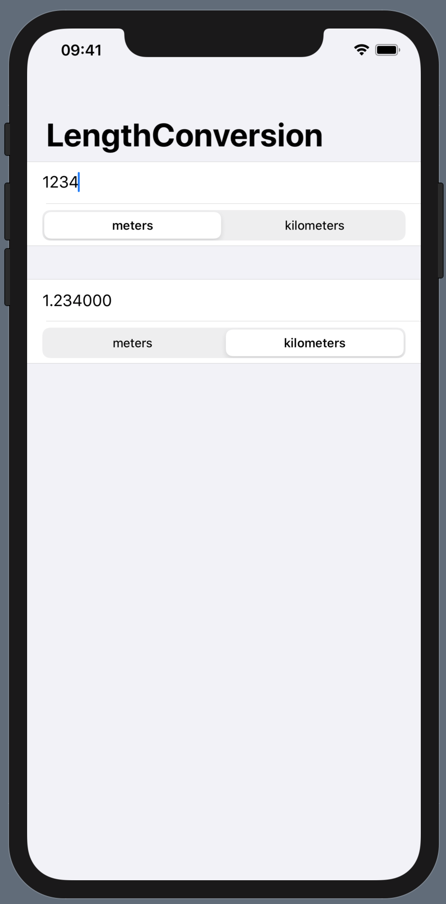

[100DaysOfSwiftUI](https://www.hackingwithswift.com/100/swiftui)の振り返り用Cheat sheetです．Day16-Day25のまとめです．

## Day16

### understanding the basic structure of a SwiftUI app

```swift
// ContentView.swift
import SwiftUI

struct ContentView: View {
    var body: some View {
        Text("Hello, World!")
    }
}

struct ContentView_Previews: PreviewProvider {
    static var previews: some View {
        ContentView()
    }
}
```

ViewはSwiftUI由来のprotocol．

some Viewのsomeは，常に同じ型のViewを返すように制限する．

TextもView.

ContentView_PreviewsはXcodeでのプレビューにのみ影響する．

Option+Cmd+Pで実行できる．

### creating a form

```swift
Form {
     Section {
         Text("Hello, World!")
         Text("Hello, World!")
         Text("Hello, World!")
         Text("Hello, World!")
         Text("Hello, World!")
         Text("Hello, World!")
         Text("Hello, World!")
         Text("Hello, World!")

     Group {
         Text("Hello, World!")
         Text("Hello, World!")
         Text("Hello, World!")
         Text("Hello, World!")
         Text("Hello, World!")
     }
}
```

Formは10個までの子要素？しか受け付けない．この10の制限はSwiftUIのあちこちに登場する．

調整するためにGroupがある．Groupは10個制限を調整するだけで，他の影響を与えない．

Sectionは区切りの間に空白を生む．

#### adding navigation bar

```swift
        NavigationView {
            Form {
                Section {
                    Text("Hello, World!")
                    Text("Hello, World!")
                    Text("Hello, World!")
                    Text("Hello, World!")
                    Text("Hello, World!")
                    Text("Hello, World!")
                    Text("Hello, World!")
                    Text("Hello, World!")
                }

                Group {
                    Text("Hello, World!")
                    Text("Hello, World!")
                    Text("Hello, World!")
                    Text("Hello, World!")
                    Text("Hello, World!")
                }
            }
            .navigationBarTitle(Text("Swift UI"), displayMode: .inline)
        }
```

NavigationViewによって，上にスクロールした時に他のUIとかぶることを防げる．

`.navigationBarTitle`によってタイトルを設定できる．

### modifying program state

```swift
struct ContentView: View {
    @State private var tapCount = 0
    
    var body: some View {
        Button("Tab count \(tapCount)") {
            self.tapCount += 1
        }
    }
}
```

ContentViewは定数として使われるので中の変数が普通は変更できないが，`@State`により変更可能となる．

privateは推奨．

### binding state to user interface controls

```swift
struct ContentView: View {
    @State private var name: String = ""
    
    var body: some View {
        Form {
            TextField("Enter your name", text: $name)
            Text("Your name is \(name)")
        }
    }
}
```

nameをUIに表示させつつ，UIからの変更をnameに反映したいというのは"two-way binding"である．

TextFieldではtwo-way bindingが必要なので，`$`をnameの前につけることで指定する．

### creating views in a loop

```swift
struct ContentView: View {
    let students = ["Harry", "Hermione", "Ron"]
    @State private var selectedStudent = 0

    var body: some View {
        VStack {
            Picker("Select your student", selection: $selectedStudent) {
                ForEach(0..<students.count) {
                    Text(self.students[$0])
                }
            }
            Text("Your pick is \(selectedStudent)")
        }
    }
}
```

ForEachでループを作れる．これは10こ制限を受けない．（Groupを自動で生成するため？）

VStackがなぜ必要か？→bodyは必ず1つだけのViewを返さなくてはならないから．

self.studentsがなぜ中でだけ必要か？→closureの中だからか．

## Day17

### reading text from the user with TextField

```swift
struct ContentView: View {
    @State private var checkAmount = ""
    @State private var numberOfPeople = 2
    @State private var tipPercentage = 2

    let tipPercentages = [10, 15, 20, 25, 0]

    var body: some View {
        Form {
            Section {
                TextField("Amount", text: $checkAmount)
                    .keyboardType(.decimalPad)
            }

            Section {
                Text("$ \(checkAmount)")
            }
        }
    }
}
```

checkAmountがStringなのは，TextFieldが必ずStringでないといけないから．

`.keyboardType`でキーボードタイプを指定できる．ただし物理キーボードで数字以外を入力されることを防げるわけではない．

### creating pickers in a form

```swift
struct ContentView: View {
    @State private var checkAmount = ""
    @State private var numberOfPeople = 2
    @State private var tipPercentage = 2

    let tipPercentages = [10, 15, 20, 25, 0]

    var body: some View {
        NavigationView {
            Form {
                Section {
                    TextField("Amount", text: $checkAmount)
                        .keyboardType(.decimalPad)
                    
                    Picker("Number of people", selection: $numberOfPeople) {
                        ForEach(2..<200) {
                            Text("\($0)")
                        }
                    }
                }

                Section {
                    Text("$ \(checkAmount)")
                }
            }
            .navigationBarTitle("WeSplit")
        }
    }
}
```

Pickerを追加するとデフォルトが2ではなく4となるが，これは2から200のindex2である．

NavigationViewを追加しないと横にページ遷移してくれず，Pickerが機能しない．

`.navigationBarTitle`はNαvigationViewに外からつけるのではなく，その一つ内側につける必要がある．

## Day19

challenge day. Length Unit Converterサンプル．

```swift
struct ContentView: View {
    @State private var convertFrom = ""
    enum LengthUnit: CaseIterable {
        case meters
        case kilometers
        case feet
        case yards
        case miles
    }
    let lengthUnitArr = ["meters", "kilometers"]
    let lengthUnitRate = [
        "meters": 1,
        "kilometers": 0.001,
    ]
    @State private var lengthUnitIdFrom = 0
    @State private var lengthUnitIdTo = 0
    var convertedLength: Double {
        let convertFromDouble = Double(convertFrom) ?? 0.0
        let convertFromUnitRate = lengthUnitRate[lengthUnitArr[lengthUnitIdFrom]]!
        
        let convertToUnitRate = lengthUnitRate[lengthUnitArr[lengthUnitIdTo]]!
        
        let convertToDouble = convertFromDouble / convertFromUnitRate * convertToUnitRate
        return convertToDouble
    }
    
    var body: some View {
        NavigationView {
            Form {
                Section {
                    TextField("What to convert from", text: $convertFrom)
                    
                    Picker(selection: $lengthUnitIdFrom, label: Text("Length Unit to convert from")) {
                        ForEach(0..<lengthUnitArr.count) {
                            Text("\(self.lengthUnitArr[$0])")
                        }
                    }.pickerStyle(SegmentedPickerStyle())
                }
                
                Section {
                    Text("\(convertedLength)")
                    
                    Picker(selection: $lengthUnitIdTo, label: Text("Length Unit to convert to")) {
                        ForEach(0..<lengthUnitArr.count) {
                            Text("\(self.lengthUnitArr[$0])")
                        }
                    }.pickerStyle(SegmentedPickerStyle())
                }
            }
            .navigationBarTitle("LengthConversion")
        }
    }
}
```



## Day20

### using stacks to arrange views

```swift
    var body: some View {
        VStack(alignment: .leading, spacing: 10) {
            Text("Hello, World!")
            Spacer()
            Text("blabla")
            
            ZStack(alignment: .center) {
                Text("Hello")
                Text("World")
            }
        }
    }
```

bodyは一つのViewしか直下におけないから，一つにまとめる必要がある．VStack, HStack, ZStackが代表的な方法．

### colors and frames

```swift
struct ContentView: View {
    var body: some View {
        ZStack{
            Color.red.edgesIgnoringSafeArea(.all)
            Color(red:1, green: 0.8, blue: 0)
            Color.red.frame(width: 200, height: 200)
            Text("Hello, World!")
                .background(Color.blue)
        }
    }
}
```

それぞれのエリアがある．

#### gradients

```swift
struct ContentView: View {
    var body: some View {
        ZStack {
            AngularGradient(gradient: Gradient(colors: [.red, .yellow, .green, .blue, .purple, .red]), center: .center).edgesIgnoringSafeArea(.all)
            LinearGradient(gradient: Gradient(colors: [.white, .black]), startPoint: .center, endPoint: .bottom).frame(width:150, height: 150)
            Text("Hello, World!")
        }
    }
}
```

### buttons and images

```swift
struct ContentView: View {
    var body: some View {
        Button(action: {
            print("button was tapped")
        }) {
            HStack(spacing: 4) {
                Image(systemName: "pencil").renderingMode(.original)
                Text("Tap me")
            }
        }
    }
}
```

Button, Imageの使い方．Buttonにはaction:が指定できる．

### showing alert messages

```swift
struct ContentView: View {
    @State private var showingAlert = false
    
    var body: some View {
        Button("Show alert") {
            self.showingAlert = true
        }
        .alert(isPresented: $showingAlert) {
            Alert(title: Text("Hello"), message: Text("World"), dismissButton: .default(Text("OK")))
        }
    }
}
```

Buttonの用法がさっきと随分違う．

### stacking up buttons

```swift
    var body: some View {
        ZStack {
            Color.blue.edgesIgnoringSafeArea(.all)
            VStack(spacing:30) {
                VStack {
                    Text("Tap the flag of...").foregroundColor(.white)
                    Text(countries[correctAnswer]).foregroundColor(.white)
                }
                
                ForEach(0..<3) { number in
                    Button(action: {
                        // flag was tapped
                    }) {
                        Image(self.countries[number])
                            .renderingMode(.original)
                    }
                }
                
                Spacer()
            }
        }
    }
}
```

